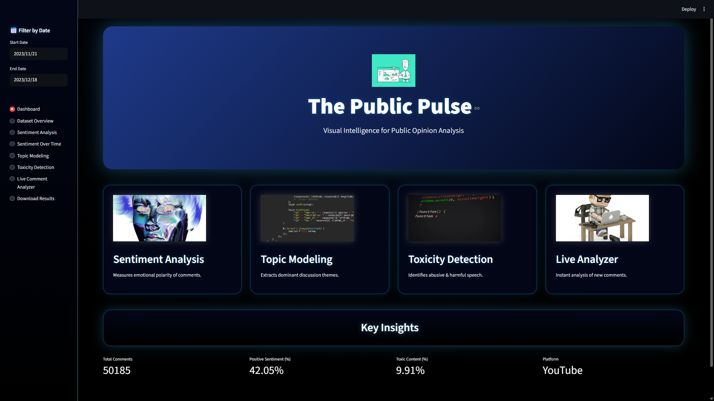
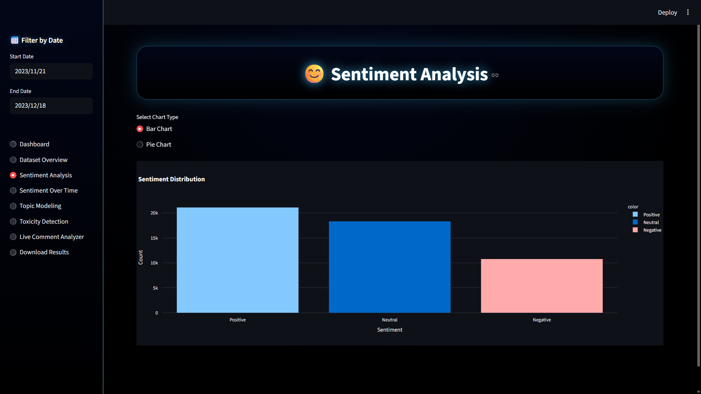
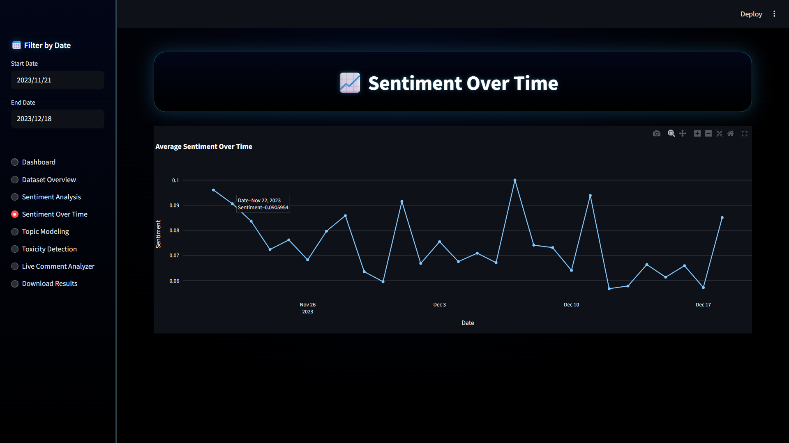
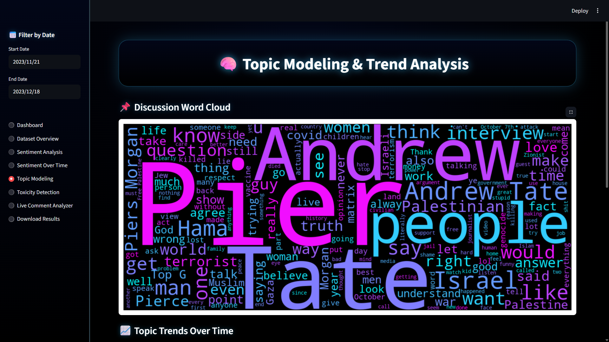
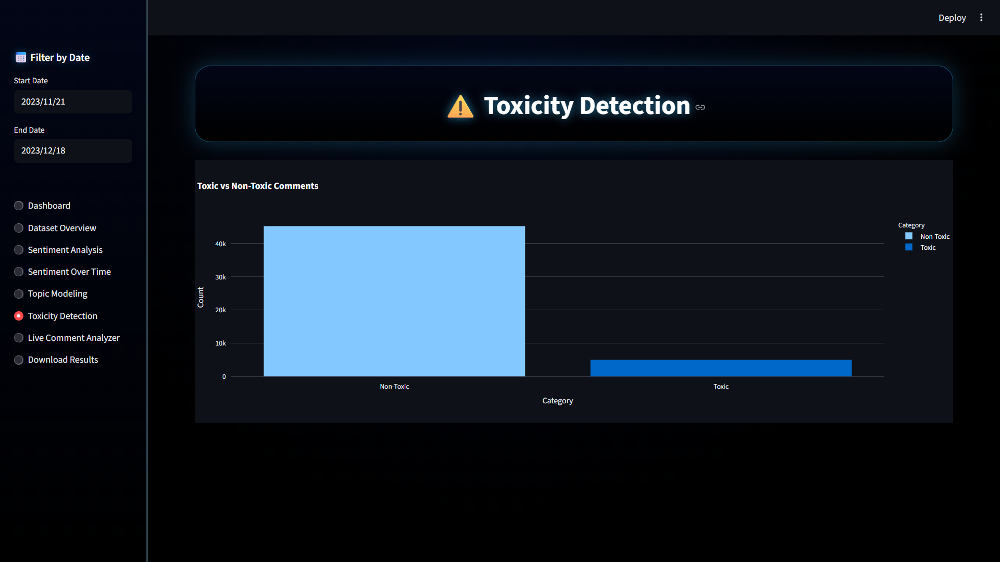

<h1 align="center">The Public Pulse</h1>

A web-based system for analyzing public opinion using YouTube comments
 

---

## About The Project

The Public Pulse is a web-based application that uses natural language processing techniques to analyze YouTube comments and extract meaningful insights about public opinion.

The system processes comment data and performs sentiment analysis using TextBlob to classify opinions as positive, negative, or neutral. It also identifies major discussion themes through keyword-based topic grouping and tracks how these topics change over time. In addition, the application detects toxic or abusive language using a rule-based filtering approach.

All results are presented through an interactive Streamlit interface, which includes visualizations such as sentiment distribution graphs, time-based trends, topic analysis charts, and word clouds. A live comment analyzer is also included to allow users to test individual comments in real time.

The goal of this project is to provide a simple, interpretable, and user-friendly tool for analyzing large volumes of social media text without relying on complex or resource-intensive models.

---

## Getting Started

To run this project locally, follow these steps.

### Prerequisites

Make sure Python is installed on your system.

### Installation

1. Clone the repository  
2. cd your_repo
2. Install required libraries  pip install -r requirements.txt
3. Run the application  pip install -r requirements.txt

---

## Usage

Once the application starts, it will open in your browser.

You can:

- View overall statistics from the dashboard  
- Analyze sentiment distribution  
- Observe trends over time  
- Explore discussion topics  
- Detect toxic comments  
- Test custom input using live analyzer  

---

## Project Features

The system provides multiple analytical capabilities in one platform:

- Sentiment classification of comments into positive, negative, and neutral categories  
- Topic trend analysis based on keyword grouping  
- Detection of toxic language using rule-based filtering  
- Interactive visualizations using graphs and charts  
- Word cloud representation of frequent terms  
- Live comment analysis feature  
- Download option for processed results  

---

## Screenshots

  
### Dashboard

### Sentiment Analysis

### Topic Modeling

### Toxicity Detection

---

## Future Scope

This project can be further improved by:

- Integrating real-time data using YouTube API  
- Applying deep learning models for improved accuracy  
- Enhancing toxicity detection using context-aware techniques  
- Supporting multiple languages  

---
